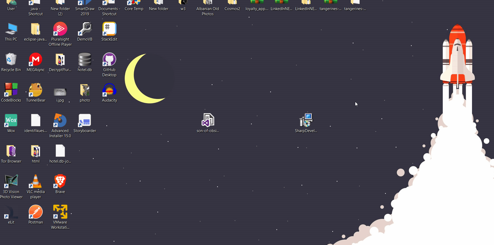
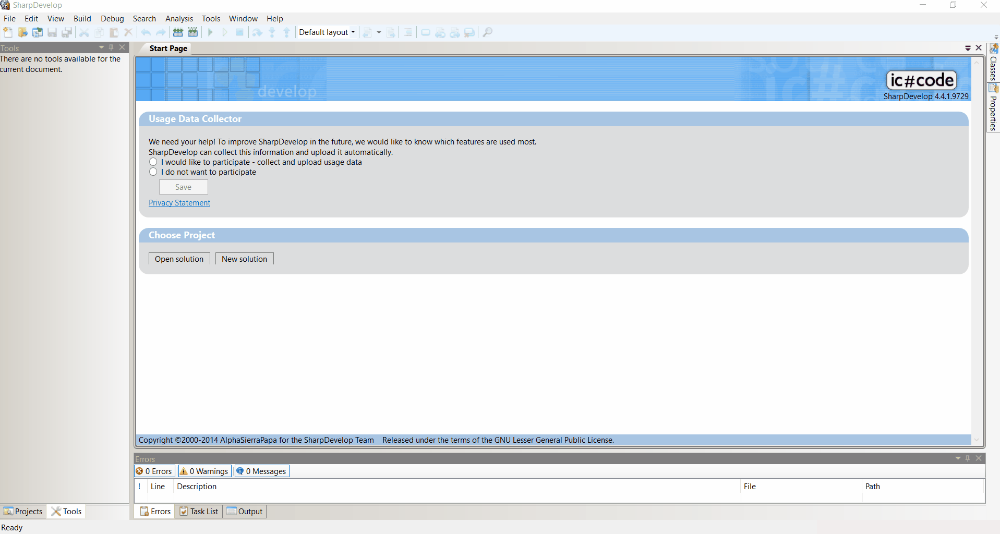

# SharpDevelop, alternativë për Visual Studio

#### Hyrje

Gjatë një bisede me një student të vitit 3 Bachelor dega TIK pranë FSHN, mësova se një nga problemet e fillimit me lëndën [Teknologji dotNet](https://sites.google.com/a/fshn.edu.al/course-22/) është Visual Studio.
Është çështje e njohur që VS (Visual Studio) kërkon pajisje me parametra të mira për të funksionuar dhe ka studentë me pajisje që nuk mund ta suportojnë ( problem që e kam patur edhe unë kur fillova të mësoj .NET ).
Duke qenë se programi mësimor përdor .NET 4.5 nuk mund të përdoret VS poshtë 2015, por VS 2015 përsëri kërkon parametra disi të lartë për të punuar pa problem.
Prandaj unë sugjeroj përdorimin e [SharpDevelop](https://en.wikipedia.org/wiki/SharpDevelop) , program i cili është ndërtuar posaçërisht për të performuar në pajisje me parametra normale.

### Instalimi

1. Fillimisht shkarko setup-in e SharpDevelop ( versioni i fundit përdor .NET 4.5 ) duke klikuar Download tek [linku](https://sourceforge.net/projects/sharpdevelop/).
2. Ndiq hapat e setup-it të instalimit
   (Për referencë kam regjistruar proçesin e instalimit si më poshtë)
   
3. Instalo [.NET 4.5.1 Developer Pack](https://www.microsoft.com/en-us/download/details.aspx?id=40772) dhe [Microsoft Windows SDK for Windows 7 and .NET Framework 4](https://www.microsoft.com/en-us/download/details.aspx?id=8279).
4. Tani mund të hapësh SharpDevelop dhe kodim të mbarë 😎

### Konfigurime Shtesë

Një nga gjërat që mungon vërtetë tek SharpDevelop është Dark Theme!
Por ka disa sajesa për të vendosur Dark Theme të paktën për editorin.
Hapat për ta vendosur këtë Theme janë si më poshtë:

1. Sharko Theme-in [Son of Obsidian](https://studiostyl.es/schemes/son-of-obsidian) duke klikuar linkun dhe ruaje në desktop.
2. Hap SharpDevelop dhe shko tek **Tools -> Options -> Text Editor -> Highlighting -> Import highlighting colors** referencë:
   
   dhe përzgjidh skedarin e Son of Obsidian që shkarkove më sipër.
3. Tani mund të eksperimentosh me SharpDevelop.
   Në regjistrimin më poshtë është një shembull i thjeshtë që shfaq stringun **Përshëndetje** në një dritare.
   

### FUND

Uroj mësim të mbarë!
Nëse dikush ka ndonjë kritikë/sugjerim/pyetje mund të më kontaktojë tek email-i *orgeskreka1995@gmail.com*

**Faleminderit**
